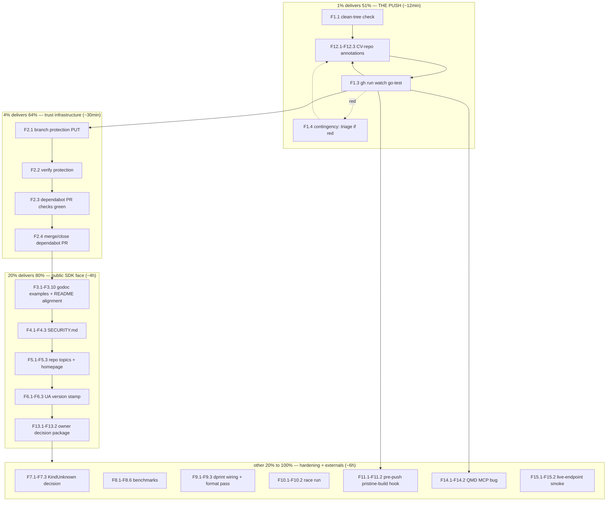

# SUPERB Pareto Execution Plan — go-graph-rag post-audit backlog

- **Date:** 2026-09-15 18:30 CEST
- **Input:** `TODO_LIST.md` (9 rows), `ROADMAP.md` (themes), status report `docs/status/2026-09-15_18-19_docs-health-audit-json-v1-restore.md` §f (20 items). ALL open todos are included and routed below.
- **Context:** Docs-health audit restored the json-v1 build contract locally (all 5 gates green pristine) and built the missing doc set. The fix is committed but **unpushed — remote CI is still red**. This plan converts the backlog into executed truth.
- **Scope discipline:** SDK repo work + two annotated CV-repo files + one external tooling bug. No API changes to the v0.1.0 surface, no new dependencies, no license changes without the owner decision (M13).

---

## 1. Pareto Breakdown

### The 1% that delivers 51% — THE PUSH

One `git push` (~12min including verification) ships: the CI-greening json-v1 fix, the restored golangci config, the complete doc set (FEATURES/TODO/ROADMAP/DOMAIN_LANGUAGE/AGENTS/README/CHANGELOG/CONTRIBUTING), and this plan. Remote truth matches local truth; the published SDK stops being red on its own front door. Everything else in this plan is worth less than this single act.

- F1.1 verify clean tree → F1.2 push → F1.3 watch `go-test` go green.

### The 4% that delivers 64% — trust infrastructure

Push + branch protection + dependabot-PR closure (~30min): after this, master cannot regress silently (protection requires `go-test`), the queued dependabot bump unblocks, and the repo's checks become load-bearing. This is the difference between "green once" and "stays green".

- F2.1–F2.4.

### The 20% that delivers 80% — the public SDK face

The above + what every consumer and pkg.go.dev visitor actually experiences (~4h): runnable godoc examples (which also compile-verify the README snippet), SECURITY.md as a trust signal, repo topics/homepage for discoverability, the version-stamped user agent, and the owner-decision package (license posture, v0.1.1 cadence) that gates all public posture.

- F3.x, F4.x, F5.x, F6.x, F13.x.

### The other 20% to reach 100% — hardening, truth, and externals

Benchmarks (perf truth for the ~50k revisit decision), dprint wiring (kills formatting drift debt), the pristine-build pre-push hook (makes THE regression class mechanically impossible), `KindUnknown`'s API fate, the one-shot `-race` run, CV-side annotation closure, the QMD MCP bug, and the optional live-endpoint smoke test.

- F7.x–F12.x, F14.x, F15.x.

---

## 2. Comprehensive Plan (medium granularity, 30–100min per task)

Sorted by importance / impact / effort / customer-value.

| #   | Task                                                              | Impact  | Effort | Customer value                                    | Depends on |
| --- | ----------------------------------------------------------------- | ------- | ------ | ------------------------------------------------- | ---------- |
| M1  | Push all pending commits; watch `go-test` to green                | Critical| 30min  | Proxy consumers see a green, truthful master      | —          |
| M2  | Branch protection on `master` (require `go-test`) + close dependabot PR | High | 30min  | Checks become load-bearing; PR queue unblocks     | M1         |
| M3  | `example_test.go`: runnable godoc examples (Build, Search, SimilarPairs, NewProvider) + align README snippet | High | 90min  | pkg.go.dev quality; compile-verified docs         | M1         |
| M4  | `SECURITY.md` (go-cqrs-lite parity) + README link                 | Medium  | 30min  | Trust signal for public repo                      | —          |
| M5  | Repo metadata: topics, homepage, description check                | Medium  | 30min  | Discoverability (GitHub + search)                 | —          |
| M6  | Version-stamp the OpenAI user agent (const + test)                | Medium  | 30min  | Correct telemetry for endpoint operators          | —          |
| M7  | `KindUnknown` decision: keep-exported+documented vs unexport      | Medium  | 30min  | API surface honesty before v1                     | —          |
| M8  | Benchmark suite: Build / Search / SimilarPairs on synthetic corpus | Medium | 100min | Perf truth for the ~50k-node design trigger       | —          |
| M9  | dprint: wire check into CI + one format pass                      | Medium  | 30min  | Ends hand-formatted-markdown drift debt           | —          |
| M10 | One-shot `go test ./... -race` (CONTRIBUTING promise)             | Low     | 30min  | Concurrency confidence                            | —          |
| M11 | Pre-push hook: pristine-build guard (`env -u GOEXPERIMENT`)       | Medium  | 30min  | Makes the json/v2 regression class impossible     | M1         |
| M12 | CV-repo annotations: status report c7 + TODO_LIST pin row         | Medium  | 30min  | Cross-repo truth (extraction story closes)        | M1         |
| M13 | Owner-decision package: license posture + v0.1.1 go-release checklist | High (direction) | 30min | Gates all public posture; unblocks release | M2         |
| M14 | QMD MCP `get`/`multi_get` bug: reproduce + fix/issue (crush config) | Low-Med | 60min  | Unblocks reliable knowledge-base retrieval        | —          |
| M15 | Env-gated live-endpoint smoke test for openai-compat provider     | Low     | 60min  | Wire contract confidence beyond httptest          | —          |

**Total: ~10.5h.** M1–M2 first (they gate trust), then M3 (highest customer value per minute), then M4–M6, M9, M11, M13; M7, M8, M10, M12 next; M14, M15 last.

---

## 3. Detailed Breakdown (fine granularity, ≤12min per task)

Sorted by importance / impact / effort / customer-value within the medium-task ordering.

| #     | Task (atomic, ≤12min)                                                  | Impact  | Effort | Verify                                  |
| ----- | ---------------------------------------------------------------------- | ------- | ------ | --------------------------------------- |
| F1.1  | `git status` clean-check; confirm exactly the expected pending commits  | Critical| 2min   | clean output                            |
| F1.2  | `git push origin master`                                                | Critical| 2min   | push ok, 0 behind                       |
| F1.3  | `gh run watch` the triggered `go-test` run                              | Critical| 10min  | run success                             |
| F1.4  | Contingency: if red — `gh run view --log-failed`, fix, re-push          | Critical| 12min  | run success                             |
| F2.1  | `gh api -X PUT .../branches/master/protection` requiring `go-test`      | High    | 5min   | HTTP 200                                |
| F2.2  | `gh api GET .../branches/master/protection` — settings echoed           | High    | 2min   | 200 + required checks                   |
| F2.3  | Re-check dependabot actions-PR checks (re-run if stale)                 | High    | 5min   | checks green                            |
| F2.4  | Merge (or close if superseded) the dependabot PR                        | Medium  | 5min   | PR closed/merged, master green          |
| F3.1  | Skim existing test conventions for example style                        | High    | 5min   | notes ready                             |
| F3.2  | Write `ExampleBuild` (deterministic output)                             | High    | 12min  | `go test -run ExampleBuild` ok          |
| F3.3  | Write `ExampleSearch` (hits + ContextText head)                         | High    | 12min  | test ok                                 |
| F3.4  | Write `ExampleSimilarPairs`                                             | High    | 12min  | test ok                                 |
| F3.5  | Write `ExampleNewProvider` (hash default + openai error case)           | Medium  | 5min   | test ok                                 |
| F3.6  | gofmt + `go build ./...` + `go vet ./...`                               | High    | 3min   | all clean                               |
| F3.7  | `go test ./...` (examples execute under `go test`)                      | High    | 5min   | ok                                      |
| F3.8  | `golangci-lint run ./...`                                               | High    | 5min   | 0 issues                                |
| F3.9  | Align README quick-start snippet with the now-compiled examples         | High    | 5min   | snippet == example body                 |
| F3.10 | `go mod tidy && git diff --exit-code go.mod go.sum`                     | Medium  | 2min   | no diff                                 |
| F4.1  | Draft `SECURITY.md` (reporting path, supported versions, scope)         | Medium  | 10min  | file reads honest                       |
| F4.2  | Link SECURITY.md from README                                             | Medium  | 2min   | link resolves                           |
| F4.3  | Verify referenced files/paths exist                                     | Low     | 3min   | grep clean                              |
| F5.1  | `gh repo edit --add-topic` graphrag,rag,embeddings,vector-search,go,sqlite | Medium | 3min  | topics echoed                           |
| F5.2  | Set homepage (pkg.go.dev module URL)                                    | Medium  | 2min   | API confirms                           |
| F5.3  | Verify via `gh api repos/...`                                           | Low     | 2min   | JSON shows values                       |
| F6.1  | Add `UserAgentVersion` const + wire UA string                           | Medium  | 5min   | build ok                                |
| F6.2  | Assert UA in an httptest (extend embedServer to capture it)             | Medium  | 5min   | test ok                                 |
| F6.3  | build + test + lint                                                     | Medium  | 5min   | all green                              |
| F7.1  | Write `KindUnknown` recommendation (keep exported: zero-value contract) | Medium  | 10min  | decision written                        |
| F7.2  | Implement chosen option (doc tightening if keep)                        | Medium  | 10min  | build + test                           |
| F7.3  | lint + CHANGELOG `[Unreleased]` entry if API-visible                    | Low     | 5min   | gates green                            |
| F8.1  | Scaffold `bench_test.go` + synthetic corpus generator                   | Medium  | 12min  | compiles                                |
| F8.2  | `BenchmarkBuild` (100/1000 docs)                                        | Medium  | 12min  | runs, sane ns/op                        |
| F8.3  | `BenchmarkSearch` (query over built index)                              | Medium  | 12min  | runs                                    |
| F8.4  | `BenchmarkSimilarPairs`                                                 | Low     | 10min  | runs                                    |
| F8.5  | Short `-benchtime` run; record numbers in the bench file doc comment    | Medium  | 10min  | numbers recorded                        |
| F8.6  | vet + lint + test                                                       | Medium  | 5min   | green                                   |
| F9.1  | Decide dprint wiring (CI step via pinned dprint release)                | Medium  | 10min  | decision noted                          |
| F9.2  | Add `dprint check` step to `go-test.yml`                                | Medium  | 5min   | CI green with step present              |
| F9.3  | Run `dprint fmt` locally; commit formatting diff                        | Medium  | 10min  | `dprint check` clean                    |
| F10.1 | `go test ./... -race` full run                                          | Low     | 10min  | ok, no races                            |
| F10.2 | Record result; fix if any race (would be a real bug)                    | Low     | 5min   | documented                              |
| F11.1 | Add `.git/hooks/pre-push` pristine-build guard (or repo script + docs)  | Medium  | 10min  | hook file present                       |
| F11.2 | Test the hook fires on a dry-run push                                   | Medium  | 5min   | blocks a broken tree                    |
| F12.1 | Annotate CV status report item c7 inline (`~~...~~ fixed at <hash>`)    | Medium  | 5min   | marker present                          |
| F12.2 | Annotate CV TODO_LIST pin-equality graphrag part                        | Medium  | 5min   | marker present                          |
| F12.3 | Commit CV-side annotations (detailed message)                           | Low     | 5min   | committed                               |
| F13.1 | License-posture recommendation: options + tradeoffs, one pick           | High    | 10min  | written for owner                       |
| F13.2 | v0.1.1 go-release checklist (tag hygiene, CHANGELOG cut, proxy verify)  | High    | 10min  | checklist ready                         |
| F14.1 | Reproduce QMD `get` bug; capture exact serialized output                | Low-Med | 10min  | repro captured                          |
| F14.2 | Locate crush qmd MCP source; fix or file issue with repro              | Low-Med | 12min  | fix/issue exists                        |
| F15.1 | Env-gated live smoke test skeleton (skip when env absent)              | Low     | 12min  | skips cleanly offline                   |
| F15.2 | Wire assertions (dims>0, unit norm) + doc how to run                    | Low     | 10min  | passes when env set                     |

**47 fine tasks.** Every medium task's verify column is a hard gate — no task is "done" without its check passing.

---

## 4. Execution Graph

Order within T3/T4 is preference, not dependency; every task ends on its verify gate.

---

## 5. VERSCHLIMMBESSER Guards (how we do NOT break the system)

1. **No API surface changes.** No renames, no signature moves, no "while at it" refactors of the v0.1.0 surface — M6/M7 touch a const and a doc comment at most.
2. **No new dependencies.** Non-negotiable #3 stands; benchmarks and examples use the existing tree only.
3. **No license or release actions without the owner.** M13 prepares, the owner decides; nothing in M1–M12 presumes the answer.
4. **Nothing pushes that isn't gate-green.** Every code-touching fine task ends with build+test+lint before its commit rides the daemon.
5. **CV repo is annotation-only.** Two inline markers (F12.1, F12.2), no rewrites of historical files.
6. **No formatter crusades.** `dprint fmt` (F9.3) touches markdown only; Go stays gofmt-clean, untouched.
7. **Branch protection before, not after, more work lands** (F2.1 precedes T3) so the safety net is up first.
8. **If CI is red after push (F1.4): stop, diagnose from logs, fix the root cause — never force, never bypass.**

## 6. TODO_LIST routing note

SDK-scoped items (M3–M11, M15) already live in `TODO_LIST.md` with evidence. M12 is CV-repo work (stays plan-only here, pointer only), M13 is owner-gated (TODO_LIST BLOCKED row), M14 is external tooling (crush config, pointer only). No TODO_LIST rewrite needed for this plan; completed items get deleted from TODO_LIST per its lifecycle as they land.

## 7. Definition of done for this plan

- Remote `go-test` green; `master` protected; dependabot queue empty.
- `go doc` shows runnable examples; README snippet compile-verified.
- SECURITY.md, topics, homepage, UA stamp, dprint check, pre-push hook: all present and verified.
- Benchmarks recorded; `-race` clean; `KindUnknown` decided.
- CV-side extraction story annotated closed; owner decisions packaged.
