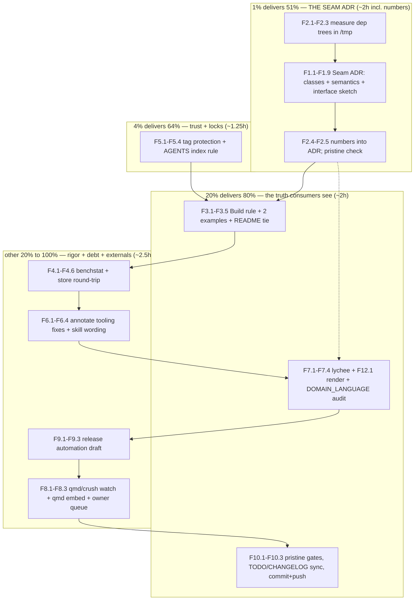

# SUPERB Execution Plan — Seam ADR + backlog close-out

- **Date:** 2026-09-16 12:15 CEST (via `date`)
- **Input:** `TODO_LIST.md` (15 open rows: 5 High, 7 Medium, 3 Low + 2 external
  closures), session loose ends from `docs/status/2026-09-16_08-04_session-close-decisions-recorded.md`
  §f (50 items), owner decisions 2026-09-16 (seam = next work; ADR + Go
  interface sketch; CGO in optional adapters only; dep-quant run soon), and the
  ROADMAP deferred arcs. ALL open todos are included and routed below.
- **Context:** The owner confirmed the pluggable store/search seam design as
  the next work item: a decision record (ADR) under `docs/planning/` WITH a Go
  interface sketch, binding before any code. This plan executes that plus every
  other open todo in the repo, then commits and pushes with explicit owner
  authorization. **Executed in full 2026-09-16: every M/F row below is struck
  with evidence** (see `docs/status/2026-09-16_14-14_seam-plan-execution-status.md`
  and `docs/status/2026-09-16_15-21_m10-ship-complete-and-regression-alert.md`);
  v0.2.0 shipped from the finished tree (`805aeba`). Two deviations, recorded
  here at archive time: F3.2's `ExampleNewStore` shipped as `ExampleOpenStore`
  (no `NewStore` identifier exists; `go vet` would reject the planned name), and
  F6.4 was rerouted upstream (fixed in the go-cqrs-lite source repo, committed
  `b13e17bba`, propagated by re-linking the installed skill; status 15-21 §a5).
- **Scope discipline:** Design doc + docs + benchmarks + repo settings + skill
  assets. NO seam implementation in core, NO new dependencies in core
  `go.mod`, NO release actions (Q1/Q2 still owner-gated), NO experiment-gated
  stdlib, research reports annotate-only.

---

## 1. Pareto Breakdown

### The 1% that delivers 51% — THE SEAM ADR

One document de-risks every future storage decision: `docs/planning/…_seam-store-search-adr.md`
with the three backend classes (a: embedded SQLite + ANN libs — native ANN;
b: metaengine engines — uniform API, brute-force vectors today; c: raw server
DBs — native ANN, schema-coupled metrics, uids-without-distances), per-class
vector semantics, and a Go interface sketch that makes the extension points
binding before any code exists. Everything else in this plan is worth less.

- M1 (F1.1–F1.9), fed by the dep numbers from M2.

### The 4% that delivers 64% — trust the numbers, lock the tags

1% + two cheap force-multipliers: the metaengine dep-tree quantification
(M2 — converts the research report's #1 CONTRA into hard `go mod graph`
numbers, owner said "soon") and the tag-protection rule (M5 — one API call
closes a real gap before any future tag exists).

- M2 (F2.1–F2.5), M5 (F5.1–F5.4).

### The 20% that delivers 80% — the truth consumers see

- The doc-truth set every pkg.go.dev visitor experiences: the `Build`
  identical-text rule documented, two new godoc examples (M3), and the
  docs-quality close-out (M7: lychee over all the new cross-links, the F12.1
  render check, DOMAIN_LANGUAGE audit). M10 ships it all: pristine gates,
  detailed commits, push, CI watch.

* M3 (F3.1–F3.5), M7 (F7.1–F7.4), M10 (F10.1–F10.3).

### The other 20% to reach 100% — rigor, tooling debt, automation, externals

Benchstat-grade benchmark numbers + a store round-trip benchmark (M4), the
docs-health tooling fixes + skill wording fix (M6), GitHub Release automation
(M9), and the external watch + owner queue (M8). The trigger-gated backlog
(ROADMAP arcs, Dgraph follow-ups, owner-gated rows) is enumerated in §5 so
nothing is forgotten — deliberately not executed.

- M4 (F4.1–F4.6), M6 (F6.1–F6.4), M8 (F8.1–F8.3), M9 (F9.1–F9.3), §5.

---

## 2. Comprehensive Plan (medium granularity, 30–100min per task)

Sorted by importance / impact / effort / customer-value.

| #   | Task                                                                                                            | Impact            | Effort | Customer value                               | Depends on |
| --- | --------------------------------------------------------------------------------------------------------------- | ----------------- | ------ | -------------------------------------------- | ---------- |
| ~~M1~~  | ~~Seam ADR: three backend classes + per-class vector semantics + Go interface sketch (`docs/planning/`)~~ done — seam ADR delivered 2026-09-16 (docs/planning/2026-09-16_13-25_seam-store-search-adr.md); status 14-14 §a M1 | ~~Critical~~ | ~~90min~~ | ~~Every future storage decision de-risked~~ | ~~M2.1–M2.3~~ |
| ~~M2~~  | ~~Dep-tree quantification: `go mod graph` before/after (status quo vs metaengine vs system+metaengine) in /tmp~~ done — measured 31→58→205 modules (ADR §6); metaengine report CONTRA #1 quantified; status 14-14 §a M2 | ~~High~~ | ~~45min~~ | ~~Hard numbers behind the metaengine rejection~~ | ~~—~~ |
| ~~M3~~  | ~~Doc truth: `Build` identical-text rule doc comment + `ExampleNewStore` + `SearcherOptions` example + README tie~~ done — Build identical-text rule at build.go:99-104; ExampleOpenStore + ExampleNewSearcherWithOptions output-verified; status 14-14 §a M3 | ~~High~~ | ~~45min~~ | ~~Correct, compile-verified public docs~~ | ~~—~~ |
| ~~M4~~  | ~~Benchmarks: benchstat protocol re-run + store round-trip benchmark (1k/10k) with recorded numbers~~ done — benchstat protocol + BenchmarkStoreRoundTrip recorded in bench_test.go doc; status 14-14 §a M4 | ~~Medium~~ | ~~60min~~ | ~~Perf truth for the ~50k trigger~~ | ~~—~~ |
| ~~M5~~  | ~~Tag protection rule + AGENTS research-index rule~~ done — protect-tags ruleset id 23541172 active (API echo); AGENTS research-index rule; CHANGELOG entry; status 14-14 §a M5 | ~~High (Security)~~ | ~~30min~~ | ~~Tags cannot be moved/deleted silently~~ | ~~—~~ |
| ~~M6~~  | ~~docs-health tooling debt: tilde-in-code-span fix, per-row completeness gate, go-cqrs-lite modules.md wording~~ done — F6.1-F6.3 in the SKILLS repo (0d1aca6); F6.4 upstream b13e17bba + installed skill re-linked, verified; status 14-14 §a M6 + 15-21 §a5 | ~~Medium (leverage)~~ | ~~45min~~ | ~~Every future annotate pass is trustworthy~~ | ~~—~~ |
| ~~M7~~  | ~~Docs close-out: `buildflow format` (lychee) over all cross-links, F12.1 render check, DOMAIN_LANGUAGE audit~~ done — lychee 6/6 OK after SECURITY.md 404 fix; F12.1 render verified via GitHub markdown API; DOMAIN_LANGUAGE 20-row audit clean; status 14-14 §a M7 | ~~Medium~~ | ~~45min~~ | ~~The doc set provably holds together~~ | ~~M1, M3~~ |
| ~~M8~~  | ~~External watch + owner queue: qmd#959/crush#3846 state, `qmd embed`, queue CV cross-link/push + live creds~~ done — qmd#959 + crush#3846 re-checked silent; owner ruled hold past 09-22 (15-21 §g3); qmd embed 1677 chunks, needs-embedding 0; status 14-14 §a M8 | ~~Low-Med~~ | ~~30min~~ | ~~Upstream loops don't rot~~ | ~~—~~ |
| ~~M9~~  | ~~GitHub Release automation workflow (fires on future tag push; no release executed)~~ done — release.yml drafted, actionlint-clean; status 14-14 §a M9 | ~~Low~~ | ~~30min~~ | ~~v0.2.0 becomes one command when approved~~ | ~~—~~ |
| ~~M10~~ | ~~Ship: pristine full gate suite, TODO_LIST/CHANGELOG sync, detailed commits, push, watch CI~~ done — F10.1 ALL GREEN (15-21 §a1); F10.3 pushed f79c58a, CI 35099876210 green; v0.2.0 shipped (805aeba); status 15-21 §a2 | ~~Critical~~ | ~~30min~~ | ~~Remote truth = local truth~~ | ~~all~~ |

**Total: ~7.5h.** M2 → M1 first (the 1%), then M5, M3; then M4, M6, M7, M9;
M8 interleaves; M10 strictly last.

---

## 3. Detailed Breakdown (fine granularity, ≤12min per task)

Sorted by importance / impact / effort / customer-value within the medium-task
ordering.

| #     | Task (atomic, ≤12min)                                                                                                                                                                      | Impact   | Effort | Verify                            |
| ----- | ------------------------------------------------------------------------------------------------------------------------------------------------------------------------------------------ | -------- | ------ | --------------------------------- |
| ~~F2.1~~  | ~~Scratch module in /tmp: require `go-graph-rag` as-is; capture `go mod graph` + go.sum count~~ done — scratch consumer module measured; ADR §6 status-quo row | ~~High~~ | ~~10min~~ | ~~baseline captured~~ |
| ~~F2.2~~  | ~~Add `metaengine` (+sqliteengine): capture delta~~ done — ADR §6 +metaengine+sqliteengine row (58/168/94) | ~~High~~ | ~~10min~~ | ~~delta table row~~ |
| ~~F2.3~~  | ~~Add `system` (+metaengine): capture delta~~ done — ADR §6 +system row (205/1020/395) | ~~High~~ | ~~10min~~ | ~~delta table row~~ |
| ~~F2.4~~  | ~~Write numbers into the ADR's dep-isolation section; ONE inline annotation on metaengine report CONTRA #1~~ done — numbers in ADR §6; quantified blockquote on metaengine report CONTRA #1 | ~~High~~ | ~~10min~~ | ~~ADR §numbers; report marker~~ |
| ~~F2.5~~  | ~~Trash /tmp module; verify root `go.mod`/`go.sum` untouched (`git diff --exit-code`)~~ done — /tmp module trashed; root go.mod/go.sum diff-clean | ~~Critical~~ | ~~5min~~ | ~~clean diff~~ |
| ~~F1.1~~  | ~~Re-read seam surfaces: `Cache`/`Store` (store.go), `Searcher` construction, `Provider` seam; note exact extension points~~ done — seam surfaces re-read; ADR §3 extension-point table | ~~High~~ | ~~10min~~ | ~~extension points noted~~ |
| ~~F1.2~~  | ~~ADR header: context (scenario B insurance), decision drivers, CGO stance (adapters-only), dep-isolation constraints~~ done — ADR header + §1-2 context/drivers; CGO stance §7; dep isolation §6 | ~~High~~ | ~~10min~~ | ~~header reads true~~ |
| ~~F1.3~~  | ~~Class A section: embedded SQLite + ANN libs — native ANN, distances returned, metric at index time, pre/post-filter semantics; candidates sqlite-vec (CGO caveat), hannoy, in-process HNSW~~ done — ADR §4.1 | ~~High~~ | ~~12min~~ | ~~section complete~~ |
| ~~F1.4~~  | ~~Class B section: metaengine engines — uniform API, brute-force O(N·D) today (<10K guidance), no ANN shipped, `Edge{From,To}` label/weight loss, adapter = projection not replacement~~ done — ADR §4.2 | ~~High~~ | ~~12min~~ | ~~section complete~~ |
| ~~F1.5~~  | ~~Class C section: raw server DBs (Dgraph exemplar) — native ANN, metric coupled at schema time, uids-without-distances, `ErrAborted` retries, ops footprint~~ done — ADR §4.3 | ~~High~~ | ~~12min~~ | ~~section complete~~ |
| ~~F1.6~~  | ~~Interface sketch: Go signatures for the Store/Cache seam extension + vector-search surface; what core exports vs what adapters own~~ done — ADR §5 sketch compiled verbatim in /tmp; real *Store proven to satisfy GraphStore (status 14-14 §1) | ~~Critical~~ | ~~12min~~ | ~~sketch compiles in a scratch file~~ |
| ~~F1.7~~  | ~~Consequences: migration path, decision triggers, what forces a breaking change vs not~~ done — ADR §8-9 migration path + triggers | ~~High~~ | ~~10min~~ | ~~triggers mirror research reports~~ |
| ~~F1.8~~  | ~~Cross-link: ROADMAP Theme 1 pointer to the ADR; `docs/research/README.md` stays research-only (no row — ADR is planning)~~ done — ROADMAP Theme 1 cross-links the ADR; research README stays research-only | ~~Medium~~ | ~~5min~~ | ~~links resolve~~ |
| ~~F1.9~~  | ~~Gates on the new doc: dprint check; markdown links lint~~ done — dprint clean; links resolve (lychee 6/6, F7.1) | ~~Medium~~ | ~~5min~~ | ~~clean~~ |
| ~~F5.1~~  | ~~Inspect current tag/rulesets state via `gh api`~~ done — ruleset state inspected via gh api (status 14-14 §a M5) | ~~High~~ | ~~5min~~ | ~~state known~~ |
| ~~F5.2~~  | ~~Add tag-protection rule (classic `tags/protection` or rulesets fallback); verify echo~~ done — protect-tags ruleset id 23541172 active, API echo verified | ~~High~~ | ~~10min~~ | ~~API echo confirms~~ |
| ~~F5.3~~  | ~~AGENTS.md: + research-index rule ("new research artifacts get a `docs/research/README.md` row")~~ done — AGENTS.md Gotchas research-index rule present | ~~Medium~~ | ~~5min~~ | ~~line present~~ |
| ~~F5.4~~  | ~~CHANGELOG `[Unreleased]` entry for tag protection~~ done — CHANGELOG tag-protection entry (now under [0.2.0] Added) | ~~Medium~~ | ~~5min~~ | ~~entry present~~ |
| ~~F3.1~~  | ~~`Build` doc comment: identical-text → single-vector rule (`resolveVectors` dedups by content hash; first doc wins, siblings expansion-only)~~ done — Build doc comment states the rule (build.go:99-104) | ~~High~~ | ~~10min~~ | ~~godoc renders; test still green~~ |
| ~~F3.2~~  | ~~`ExampleNewStore`: OpenStore → Put → Load round trip, `// Output:` verified~~ done — delivered as ExampleOpenStore (rename: no NewStore identifier exists); output-verified example_test.go:141 | ~~Medium~~ | ~~12min~~ | ~~`go test -run ExampleNewStore` ok~~ |
| ~~F3.3~~  | ~~`SearcherOptions` example variant: ReferenceKind/DocumentKinds roles, output-verified~~ done — ExampleNewSearcherWithOptions output-verified (example_test.go:190) | ~~Medium~~ | ~~12min~~ | ~~`go test -run` ok~~ |
| ~~F3.4~~  | ~~Gates: build/vet/test/lint~~ done — build/vet/test/lint green (status 14-14 §a M3) | ~~High~~ | ~~5min~~ | ~~all green~~ |
| ~~F3.5~~  | ~~README "Search-time roles": pointer to the new example~~ done — README Search-time-roles section points at the example | ~~Low~~ | ~~5min~~ | ~~link resolves~~ |
| ~~F4.1~~  | ~~Obtain benchstat (pinned `go run golang.org/x/perf/cmd/benchstat@version` or nix)~~ done — benchstat via pinned golang.org/x/perf v0.0.0-20260908200009 (bench_test.go doc) | ~~Medium~~ | ~~5min~~ | ~~runs~~ |
| ~~F4.2~~  | ~~Run Build/Search/SimilarPairs 10×; benchstat summary~~ done — benchstat table in bench_test.go doc (±1-2% spread) | ~~Medium~~ | ~~12min~~ | ~~table produced~~ |
| ~~F4.3~~  | ~~Update `bench_test.go` doc comment: benchstat numbers + env replace single-run numbers~~ done — bench_test.go doc comment rewritten with protocol + numbers | ~~Medium~~ | ~~10min~~ | ~~doc matches reality~~ |
| ~~F4.4~~  | ~~Write `BenchmarkStoreRoundTrip` (persist + LoadGraph/LoadEmbeddings, 1k/10k)~~ done — BenchmarkStoreRoundTrip in bench_test.go | ~~Medium~~ | ~~12min~~ | ~~runs, sane ns/op~~ |
| ~~F4.5~~  | ~~Run round-trip bench; record reference numbers in its doc comment~~ done — 21.6ms/1k and 197.4ms/10k recorded in the bench doc comment | ~~Medium~~ | ~~10min~~ | ~~numbers recorded~~ |
| ~~F4.6~~  | ~~Gates: build/vet/test/lint~~ done — gates green (status 14-14 §a M4) | ~~Medium~~ | ~~5min~~ | ~~all green~~ |
| ~~F6.1~~  | ~~`annotate-rows.py`: skip already-annotated guard when `~~` occurs only inside code spans~~ done — code-span-aware guard in SKILLS repo (0d1aca6), regression-tested | ~~Medium~~ | ~~12min~~ | ~~F12.1-row case passes~~ |
| ~~F6.2~~  | ~~Add per-row completeness checker to docs-health assets (struck rows == table rows per table)~~ done — check-rows.py added; regression suite green (status 14-14 §a M6) | ~~Medium~~ | ~~12min~~ | ~~catches a planted miss~~ |
| ~~F6.3~~  | ~~Regression-test both fixes against `docs/planning/archived/` plan~~ done — archived plan COMPLETE, planted miss caught, F12.1 dry-run proceeds | ~~Medium~~ | ~~10min~~ | ~~0 false positives/negatives~~ |
| ~~F6.4~~  | ~~Fix go-cqrs-lite skill `modules.md`: `system` Experimental marker wording (FEATURES.md-only, not module-level)~~ done — fixed upstream (b13e17bba) + installed copy re-linked, verified (15-21 §a5) | ~~Low~~ | ~~10min~~ | ~~skill reads true~~ |
| ~~F7.1~~  | ~~`buildflow format` full pass (dprint + lychee) over repo docs~~ done — lychee 6/6 OK 0 errors after SECURITY.md 404 fix | ~~Medium~~ | ~~12min~~ | ~~0 link errors, dprint clean~~ |
| ~~F7.2~~  | ~~F12.1 render check: fetch rendered GitHub HTML of the archived plan; verify strike + code span~~ done — GitHub markdown API: strike renders, literal tildes protected in code span | ~~Low~~ | ~~10min~~ | ~~renders as intended~~ |
| ~~F7.3~~  | ~~`docs/DOMAIN_LANGUAGE.md` line-by-line audit vs code (terms, file refs)~~ done — 20-row audit vs code: all accurate | ~~Medium~~ | ~~12min~~ | ~~findings listed~~ |
| ~~F7.4~~  | ~~Fix audit findings (drift, stale refs)~~ done — SECURITY.md 404 fixed (live URL verified); README Reindex phantom → ReplaceGraph | ~~Medium~~ | ~~10min~~ | ~~re-audit clean~~ |
| ~~F9.1~~  | ~~Draft `.github/workflows/release.yml`: on tag push `v*`, `gh release create` from CHANGELOG notes~~ done — release.yml on v* tag push: extraction + gh release create | ~~Low~~ | ~~12min~~ | ~~file present~~ |
| ~~F9.2~~  | ~~Validate workflow (actionlint if available; else YAML parse + `gh workflow view` after push)~~ done — actionlint 1.7.12 + YAML parse clean | ~~Low~~ | ~~10min~~ | ~~no syntax errors~~ |
| ~~F9.3~~  | ~~CHANGELOG entry for the automation (no release executed)~~ done — CHANGELOG release-automation entry (now under [0.2.0] Added) | ~~Low~~ | ~~5min~~ | ~~entry present~~ |
| ~~F8.1~~  | ~~Check tobi/qmd#959 + charmbracelet/crush#3846 state; note-only (1-week PR window ends 2026-09-22)~~ done — both OPEN + silent 2026-09-16; owner ruled hold past 09-22 (15-21 §g3) | ~~Low-Med~~ | ~~10min~~ | ~~states recorded~~ |
| ~~F8.2~~  | ~~Run `qmd embed` (173 CV docs unembedded; external tooling)~~ done — 1677 chunks / 173 docs; MCP status needs-embedding 0 | ~~Low~~ | ~~12min~~ | ~~banner count drops~~ |
| ~~F8.3~~  | ~~Queue owner questions at close: CV cross-link decision, CV push, live-smoke creds~~ done — queued as 15-21 §g; all three answered 2026-09-16 | ~~Medium~~ | ~~5min~~ | ~~queued in closing message~~ |
| ~~F10.1~~ | ~~Full pristine suite: `env -u GOEXPERIMENT` build/vet/test, golangci, tidy drift, dprint~~ done — ALL GREEN ~14:25 (15-21 §a1) | ~~Critical~~ | ~~12min~~ | ~~all green~~ |
| ~~F10.2~~ | ~~TODO_LIST sync (delete done rows) + CHANGELOG entries for everything landed~~ done — TODO_LIST rewritten (done rows deleted); FEATURES re-cited; AGENTS #3 → ADR | ~~High~~ | ~~12min~~ | ~~list reflects truth~~ |
| ~~F10.3~~ | ~~Detailed commits + push + watch `go-test` to green~~ done — pushed f79c58a + 660d48c; CI 35099876210/35100154277 green; v0.2.0 shipped (805aeba) | ~~Critical~~ | ~~12min~~ | ~~CI green on new HEAD~~ |

**46 fine tasks.** Every task ends on its verify gate — no task is done
without its check passing.

---

## 4. Execution Graph

Order within T3/T4 is preference, not dependency; every task ends on its
verify gate. F10 runs strictly last.

---

## 5. Explicitly deferred / trigger-gated (enumerated so NOTHING is lost)

Not executed in this plan; each has a recorded trigger or gate:

1. License posture (owner package Q1) — BLOCKED on owner.
2. ~~v0.2.0 cut + checklist (owner package Q2) — BLOCKED on owner.~~ Executed
   2026-09-16 (`805aeba`; the tag-push release workflow failed on an awk
   extraction bug, fixed `350b815`, release created manually — annotated in the
   owner package).
3. CONTRIBUTING inbound-grant line — BLOCKED on Q1.
4. CV-repo push (carries `16fc16c7` annotations) — owner action.
5. CV-side cross-link decision for the metaengine report — owner taste.
6. Live-endpoint smoke test execution — BLOCKED on `GRAPHRAG_LIVE_EMBED_*`.
7. ANN/HNSW spike (`sqlite-vec`/`hannoy`/in-process) — after the seam ADR
   defines the integration point; ~50k trigger (owner: corpus NO until ~2027-09).
8. Incremental indexing design — ROADMAP; same trigger.
9. Shared ANN benchmark harness + metadata-filtered ANN semantics + ANN-winner
   ADR — ROADMAP; the seam ADR (M1) is their umbrella.
10. Wire-contract golden tests (`Hit`/`SearchResult` frozen) — v1 approach.
11. Metrics/tracing seams, store compaction + cache eviction, backup/export
    story — ROADMAP Theme 3.
12. Dgraph trigger-gated follow-ups: §8 spike, dgo v240/v250, 2021–2025
    license history, second community source, release tripwires, CVE review,
    importer-count recheck, raw-notes appendix, lychee JSON-link tolerance.
13. Second SDK consumer → isolated `go-graph-rag/metaengine` adapter module.
14. Corpus re-ask at the ~2027-09 horizon.

---

## 6. VERSCHLIMMBESSER Guards (how we do NOT break the system)

1. **Design, not implementation.** The seam ADR is a document with a sketch;
   no seam code enters core, no exported API changes, no refactors.
2. **No new dependencies in core.** The dep experiment runs in a /tmp scratch
   module, trashed afterwards; root `go.mod`/`go.sum` must diff clean (F2.5).
3. **No release actions.** Q1/Q2 unanswered; M9 drafts automation only —
   nothing tags, nothing releases.
4. **Pristine gates everywhere.** Every Go-touching fine task ends in
   build/vet/test/lint; the pre-push hook re-proves the pristine build.
5. **Research reports are annotate-only.** One inline marker max (F2.4);
   never rewrite.
6. **Skill assets: fix, but regression-test first.** F6.3 runs both tooling
   fixes against the archived plan before considering them done.
7. **External repos: watch, don't push.** CV, qmd, crush — no pushes, no
   baseline edits that aren't mine to judge.
8. **Nothing pushes that isn't gate-green** (F10.1 before F10.3); if CI is
   red after push: stop, read logs, fix root cause — never force.

## 7. TODO_LIST routing note

The plan consumes existing TODO_LIST rows (seam, dep-quant, Build doc comment,
tag protection, benchstat, both examples, store round-trip, release
automation, external watch); completed rows are deleted at F10.2 per the
TODO lifecycle. BLOCKED rows (license, v0.2.0, live smoke) stay untouched.
No new rows expected; if an audit finds new work, it gets a row, not a
silent fix.

## 8. Definition of done for this plan

- Seam ADR exists: three classes, per-class vector semantics, compiling
  interface sketch, CGO stance, dep numbers, triggers — cross-linked from
  ROADMAP.
- Tag protection verified via API; AGENTS research-index rule present.
- `Build` rule documented; `ExampleNewStore` + `SearcherOptions` example
  output-verified; README points at them.
- benchstat-grade numbers + store round-trip benchmark recorded in-file.
- docs-health tooling fixes regression-tested; go-cqrs-lite skill wording
  fixed.
- lychee clean over all cross-links; F12.1 render verified; DOMAIN_LANGUAGE
  audited.
- Release automation drafted (not executed); watch states recorded; owner
  queue handed back.
- Pristine gates green; TODO_LIST/CHANGELOG truth-synced; committed with
  detailed messages and pushed; CI green.
