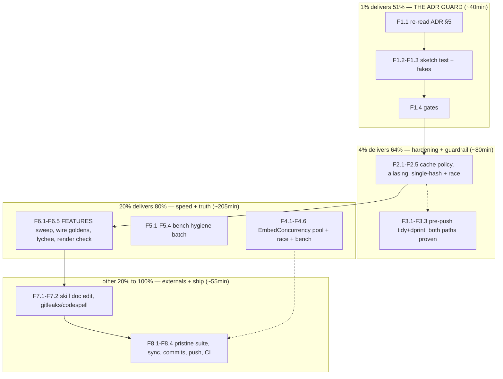

# SUPERB Execution Plan — Hardening + speed + truth (review R1–R4 landed, zero API surface risk)

- **Date:** 2026-09-19 15:39 CEST (via `date`)
- **Input:** `TODO_LIST.md` (9 open rows: 1 High BLOCKED, 5 Medium, 3 Low),
  the architecture review
  `docs/architecture-understanding/2026-09-19_13-30_architecture-review.html`
  (R1–R6 + deferred R7/R8), status report
  `docs/status/2026-09-19_14-04_docs-health-audit-and-architecture-review.md`
  §b/§c loose ends, and the three open owner questions (g1 cache policy,
  g2 dot fast path, g3 archive line — unanswered; handled in §5/D-block).
  ALL open todos are included and routed below.
- **Context:** The architecture review says superb is six moves away, not a
  rewrite. This plan executes the four moves that need NO owner decision and
  NO API-surface change: the ADR compile-only guard (R1), the SDK hardening
  batch (R2 with a recorded default policy + R3), the pre-push guard
  extension, and the opt-in embed-concurrency lever (R4) — then closes the
  truth debt (exhaustive FEATURES sweep, wire goldens, full format gate) and
  ships with explicit commits + push (owner-authorized in this instruction).
- **Scope discipline:** Existing-package hardening and additive options only.
  NO new dependencies (worker pool is stdlib channels), NO experiment-gated
  stdlib, NO changes to the wire contract, NO seam implementation in core,
  NO external-repo pushes, NO release/tag actions. Deterministic outputs are
  pinned by existing goldens and MUST stay byte-identical except where a
  CHANGELOG-documented fix says otherwise.

---

## 1. Pareto Breakdown

### The 1% that delivers 51% — THE ADR GUARD (M1)

One test file turns the binding design into a compile-enforced contract: the
ADR §5 interfaces copied verbatim, `var _ GraphStore = (*Store)(nil)` proving
the real store still satisfies the sketch, and fake implementations keeping
the seam honest before any adapter exists. If core drifts, the build breaks
instead of the design silently rotting. Everything else in this plan is
worth less, because every future storage decision leans on this sketch.

- M1 (F1.1–F1.4).

### The 4% that delivers 64% — trust + guardrails (M2 + M3)

Two hardening fixes where the code is softer than its own docs (aliasing,
cache-error swallowing, double hashing) and one hook extension that would
have caught the json-v2 regression two of its three occurrences earlier.
Cheap, local, provable.

- M2 (F2.1–F2.5), M3 (F3.1–F3.3).

### The 20% that delivers 80% — the speed lever + the truth consumers see

The only big end-to-end win that needs no owner gate: opt-in concurrent
embedding batches (network-bound cold builds pay RTT × batch-count serially
today). Paired with the benchmark-hygiene batch so the numbers stay honest,
and the truth close-out (exhaustive FEATURES citation sweep, wire-contract
golden tests, full lychee gate, lychee redirect URL) so the public face
stays load-bearing.

- M4 (F4.1–F4.6), M5 (F5.1–F5.4), M6 (F6.1–F6.5).

### The other 20% to reach 100% — externals, hygiene, ship

Skill-repo doc fix (edit only, no external push), gitleaks/codespell pass,
review-HTML render check, then the strictly-last ship block: pristine full
suite, TODO/CHANGELOG truth sync, detailed commits, push, CI watch.

- M7 (F7.1–F7.2), M8 (F8.1–F8.4), §5.

---

## 2. Comprehensive Plan (medium granularity, 30–100min per task)

Sorted by importance / impact / effort / customer-value.

| #  | Task                                                                                                                                                            | Impact          | Effort | Customer value                                              | Depends on |
| -- | --------------------------------------------------------------------------------------------------------------------------------------------------------------- | --------------- | ------ | ----------------------------------------------------------- | ---------- |
| M1 | ADR §5 compile-only guard: verbatim interface copy + `var _` assertions + fake GraphStore/VectorIndex composition test                                          | Critical        | 40min  | The binding design cannot rot against core                  | —          |
| M2 | SDK hardening: cache read errors fail fast (policy recorded, alternative documented), Searcher clones caller inputs, single-hash resolveVectors                 | High            | 55min  | No silent re-embedding cost; immutability structural        | M1         |
| M3 | Pre-push guard extension: tidy-drift + dprint checks after the pristine build                                                                                   | High (Security) | 25min  | The regression class that hit 3× loses 2 of 3 entry vectors | —          |
| M4 | `EmbeddingConfig.EmbedConcurrency` (default 1): bounded stdlib worker pool over embed batches, order-preserving, `-race`-proven                                 | High            | 90min  | ~N× on network-bound cold builds, opt-in                    | —          |
| M5 | Benchmark hygiene: 10k fixture-cost doc comment, `BenchmarkSimilarPairs/docs=100`, benchstat (`-count 10`) round-trip numbers                                   | Medium          | 45min  | Perf truth stays reproducible                               | —          |
| M6 | Truth close-out: exhaustive FEATURES citation sweep (all ~40 rows), wire-contract golden tests, full lychee gate, lychee redirect URL, review-HTML render check | Medium          | 70min  | The public doc face provably holds together                 | M2         |
| M7 | Externals + hygiene: check-rows.py doc into SKILLS-repo SKILL.md (edit only, NO external commit), gitleaks/codespell pass                                       | Low             | 20min  | Tooling debt shrinks; secrets stay clean                    | —          |
| M8 | Ship: full pristine gate suite, TODO/CHANGELOG sync (done rows deleted), detailed per-concern commits, push, watch `go-test`                                    | Critical        | 35min  | Remote truth = local truth                                  | all        |

**Total: ~6.3h.** M1 first (the 1%), then M2 (feeds M6's sweep), then M3;
M4/M5/M7 interleave; M6 after M2 lands; M8 strictly last.

---

## 3. Detailed Breakdown (fine granularity, ≤12min per task)

Sorted by importance / impact / effort / customer-value within the medium-task
ordering.

| #    | Task (atomic, ≤12min)                                                                                                                                                                           | Impact   | Effort | Verify                                            |
| ---- | ----------------------------------------------------------------------------------------------------------------------------------------------------------------------------------------------- | -------- | ------ | ------------------------------------------------- |
| F1.1 | Re-read ADR §5 verbatim + store/search surfaces; note what the guard must pin (interface text identity, `var _` assertions, fakes)                                                              | High     | 8min   | drift rules noted                                 |
| F1.2 | Create `adrsketch_test.go`: §5 types copied verbatim with a doc comment binding them to the ADR (edit-the-ADR-first rule)                                                                       | Critical | 12min  | compiles pristine                                 |
| F1.3 | `var _ GraphStore = (*Store)(nil)` + fake GraphStore + fake VectorIndex + one composition smoke test (fake index → Searcher-shaped consumer)                                                    | High     | 12min  | `go test -run ADRSketch` ok                       |
| F1.4 | Gates: build/vet/test pristine                                                                                                                                                                  | High     | 5min   | all green                                         |
| F2.1 | Record the cache-read policy: FAIL FAST chosen (symmetric with the write path, no silent re-embed cost); alternative (`CacheErrors` counter) documented in the code comment + CHANGELOG wording | High     | 8min   | decision visible in code docs                     |
| F2.2 | Implement: `lookupCache` returns error → `Build` wraps and fails; update affected tests + add one cache-error test                                                                              | High     | 12min  | `go test -run Build` ok, new test passes          |
| F2.3 | Single-hash `resolveVectors`: record hash-by-doc-ID during classification, reuse in the assignment loop; drop the second `HashText` pass                                                        | Medium   | 8min   | cache-hit tests still green                       |
| F2.4 | Searcher aliasing: clone `vectors` map + `DocumentKinds` slice in `NewSearcherWithOptions`; doc comment updated ("inputs are cloned")                                                           | High     | 10min  | immutability test (mutate-after-construct) passes |
| F2.5 | Gates: build/vet/test + `go test ./... -race` (hardening touches shared paths)                                                                                                                  | High     | 10min  | all green incl. race                              |
| F3.1 | Extend `.githooks/pre-push`: after the pristine build, run `go mod tidy && git diff --exit-code go.mod go.sum` + `dprint check` (nix-run)                                                       | High     | 12min  | hook script exits correctly on each step          |
| F3.2 | Prove BOTH paths: clean tree passes; planted tidy-drift and planted dprint failure each BLOCK the push                                                                                          | High     | 10min  | two blocked dry-run pushes observed               |
| F3.3 | Update CONTRIBUTING (hook contract) + AGENTS.md gotcha (3-of-3 gates now hooked)                                                                                                                | Medium   | 5min   | docs match the script                             |
| F4.1 | Design: `EmbeddingConfig.EmbedConcurrency` (koanf `embed_concurrency`, default 1); worker pool via channels+WaitGroup; results index-slotted to preserve order                                  | High     | 10min  | design noted in doc comment                       |
| F4.2 | Implement pool in `embedBatch` loop path (batch sharding unchanged); concurrency ≤ 1 must take the identical serial path                                                                        | High     | 12min  | unit tests green                                  |
| F4.3 | Tests: order preservation under concurrency (httptest double asserting overlap), ctx-cancel mid-flight, default-1 serial equivalence                                                            | High     | 12min  | new tests pass                                    |
| F4.4 | `go test ./... -race` (mandatory: new goroutines)                                                                                                                                               | Critical | 8min   | race clean                                        |
| F4.5 | Bench before/after with the hash provider is NOT network-bound — instead bench the pool overhead at concurrency 1 vs 4 against an httptest double; record in bench_test.go doc                  | Medium   | 12min  | numbers recorded                                  |
| F4.6 | CHANGELOG [Unreleased] Added entry + FEATURES provider row update (config field documented)                                                                                                     | Medium   | 5min   | entries present                                   |
| F5.1 | bench_test.go doc comment: document the ~37s 10k fixture-build cost per count so runs don't look hung                                                                                           | Low      | 5min   | doc matches reality                               |
| F5.2 | Add `BenchmarkSimilarPairs/docs=100` for size symmetry                                                                                                                                          | Low      | 8min   | `go test -bench SimilarPairs -benchtime 1x` ok    |
| F5.3 | benchstat `BenchmarkStoreRoundTrip` with `-count 10`; record the table in its doc comment (replaces count=3 spread)                                                                             | Medium   | 12min  | table recorded                                    |
| F5.4 | Gates: build/vet/test/lint                                                                                                                                                                      | Medium   | 5min   | all green                                         |
| F6.1 | Exhaustive FEATURES sweep: script every `file:line` claim (rg-driven), fix all drift, re-verify                                                                                                 | High     | 12min  | zero stale citations                              |
| F6.2 | Wire-contract golden tests: marshal `Hit`/`SearchResult`/`Node`/`Edge` JSON to pinned golden files (testdata/) with a regeneration note                                                         | High     | 12min  | `go test -run WireGolden` ok                      |
| F6.3 | Full lychee gate over repo docs (buildflow format or standalone lychee); fix anything it reports                                                                                                | Medium   | 12min  | 0 link errors                                     |
| F6.4 | Resolve the lychee-reported redirecting URL to its final target (TODO_LIST Low row)                                                                                                             | Low      | 8min   | lychee re-run clean                               |
| F6.5 | Review-HTML render check: headless screenshot if tooling exists, else anchor/id + parser re-check and disclose                                                                                  | Low      | 8min   | renders or disclosed                              |
| F7.1 | SKILLS repo: add `check-rows.py` to docs-health `SKILL.md` body — EDIT ONLY, no commit/push there (external ruling pending)                                                                     | Low      | 10min  | skill body mentions the tool                      |
| F7.2 | gitleaks + codespell one-shot pass over the working tree docs                                                                                                                                   | Low      | 8min   | 0 findings (or triaged)                           |
| F8.1 | Full pristine suite: `env -u GOEXPERIMENT` build/vet/test, `-race`, golangci, tidy-drift, dprint                                                                                                | Critical | 12min  | ALL GREEN                                         |
| F8.2 | TODO_LIST sync: delete the done rows (pre-push, ADR guard, embed concurrency, hardening batch, benchmark hygiene, lychee URL; check-rows stays until its ruling); CHANGELOG complete            | High     | 10min  | list reflects truth                               |
| F8.3 | Detailed per-concern commits (explicit paths, one concern each; re-check `git status` in the SAME command — daemon races)                                                                       | Critical | 12min  | history tells the story                           |
| F8.4 | Push (pre-push hook runs all three guards), watch `go-test` to green on the new HEAD                                                                                                            | Critical | 10min  | CI green                                          |

**34 fine tasks.** Every task ends on its verify gate — no task is done
without its check passing.

---

## 4. Execution Graph

Order within T3 is preference, not dependency; every task ends on its
verify gate. M2 before M6 (the sweep must see the final code). M8 runs
strictly last.

---

## 5. Explicitly deferred / owner-gated (enumerated so NOTHING is lost)

Not executed in this plan; each has a recorded gate or decision:

1. **Q1 license posture** — BLOCKED on owner (package Q1; now gates all
   public godoc). CONTRIBUTING inbound-grant line queues behind it.
2. **g1 → R2 alternative**: cache-error COUNTER approach — the plan ships
   FAIL FAST as the recorded recommendation; one word flips it to the
   counter variant (~10 min rework).
3. **g2 → R6 dot-of-normalized fast path** — deferred: owner-visible score
   drift + golden re-pin; executes only on the owner's go.
4. **g3 → status-report archive line** — no archives this pass; 14-14 stays
   in `docs/status/` pending the ruling.
5. **R5 parallel pairwise scan** — ROADMAP Theme 1 fuel per the 2026-09-15
   corpus decision (byte-identical output makes it safe whenever it fires).
6. **v0.2.0 CV consumer bump** (owner package Phase 8, external repo).
7. **CV repo push** (carries `16fc16c7`) and **go-cqrs-lite push ruling**
   (ahead 32, foreign dirty tree) — external, owner action.
8. **qmd#959/crush#3846 send-or-drop** — held past 2026-09-22 by owner
   ruling; patches live in the issue texts.
9. **Live-endpoint smoke test** — BLOCKED on `GRAPHRAG_LIVE_EMBED_*` creds.
10. **R7/R8 arcs** — land ADR §5 interfaces + reference VectorIndex (on
    implementation approval), ANN spike/harness/filtered-semantics/ADR at
    the ~50k trigger, incremental indexing, wire-contract v1 freeze
    decisions, metrics/tracing, compaction/eviction, backup/export.
11. **Dgraph/metaengine trigger-gated sweeps; corpus re-ask ~2027-09;
    second-consumer watch** — unchanged.
12. **SKILLS-repo commit/push of F7.1's edit** — the edit lands uncommitted;
    push needs the same class of explicit ruling as 2026-09-16.

---

## 6. VERSCHLIMMBESSER Guards (how we do NOT break the system)

1. **Determinism is load-bearing.** The goldens (hardening_test.go) pin
   byte-stable renders; the only output-affecting change in this plan is the
   cache fail-fast error path (new failure, not changed success output).
   Success-path outputs must be byte-identical — verified by the existing
   golden tests, no re-pinning.
2. **No new dependencies.** The worker pool is channels + WaitGroup;
   benchstat already has its pinned invocation; lychee runs via the
   existing toolchain. Core `go.mod` must diff to +0 lines.
3. **No experiment-gated stdlib.** Every Go-touching task ends in the
   pristine build; the extended pre-push hook enforces all three gates from
   F3 onward.
4. **Concurrency is opt-in and provably inert at default.**
   `EmbedConcurrency ≤ 1` takes the identical serial path; `-race` runs in
   F4.4 and again in the final suite (F8.1).
5. **External repos: edit, don't commit, don't push** (F7.1) — same guard as
   the seam plan's #7.
6. **Nothing pushes that isn't gate-green** (F8.1 before F8.4); if CI is red
   after push: stop, read logs, fix root cause — never force.
7. **Research/planning docs are annotate-only** — this plan's execution
   status goes into `docs/status/` at close, never by rewriting history.

---

## 7. TODO_LIST routing note

The plan consumes the following open rows: pre-push extension, ADR drift
guard, embed concurrency, hardening batch (cache policy + aliasing +
single-hash), benchmark hygiene, lychee URL — completed rows are deleted at
F8.2 per the TODO lifecycle. BLOCKED rows (Q1, live smoke, CONTRIBUTING) and
the qmd/crush watch row stay untouched. The check-rows SKILL.md row stays
open until the external-repo ruling lands (F7.1 edits only).

---

## 8. Definition of done for this plan

- `adrsketch_test.go` exists: verbatim §5 interfaces, `var _ GraphStore`
  proof against the real `*Store`, fake implementations, green composition
  test — ADR drift now breaks the build.
- Cache read errors fail `Build` with a wrapped error (policy + alternative
  documented); `resolveVectors` hashes once; Searcher clones caller inputs.
- `.githooks/pre-push` runs pristine build + tidy-drift + dprint; both
  blocking paths proven; docs updated.
- `EmbeddingConfig.EmbedConcurrency` ships (default 1), order-preserving,
  `-race`-clean, benched at 1 vs 4, CHANGELOG + FEATURES updated.
- Benchmark hygiene batch landed; round-trip bench is benchstat-grade.
- Wire goldens pin `Hit`/`SearchResult`/`Node`/`Edge` JSON; exhaustive
  FEATURES sweep at zero stale citations; lychee clean incl. the resolved
  redirect; review HTML render-checked or disclosed.
- gitleaks/codespell clean; SKILL.md edited upstream (uncommitted there).
- Pristine full suite + `-race` ALL GREEN; TODO_LIST/CHANGELOG truth-synced;
  per-concern detailed commits pushed; `go-test` green on the new HEAD.
